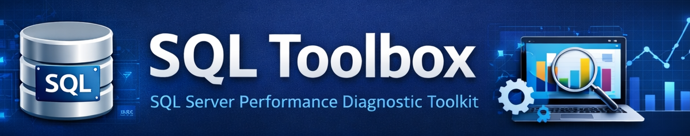
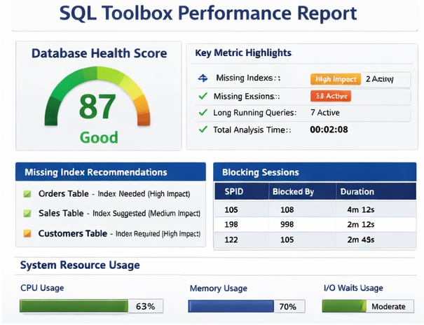

# SQL Toolbox


A practical SQL Server performance diagnostic toolkit built from real production troubleshooting.

Designed for developers and DBAs who need fast answers when a SQL Server database becomes slow.

---

## What is SQL Toolbox?

SQL Toolbox is a collection of SQL Server diagnostic scripts that help identify performance problems quickly.

Typical issues it helps investigate:

- slow SQL Server performance
- blocking sessions
- missing indexes
- long running queries
- database health problems
- performance regressions

The goal is simple:

When a database is slow, developers should be able to find the root cause in minutes — not hours.

---

## Try it in 30 seconds

1. Download the installation script  
2. Run it in your SQL Server instance  
3. Execute:

```sql
EXEC SQLToolbox.RunAll;
```

The script generates a quick diagnostic overview including:

- blocking sessions
- missing indexes
- slow queries
- database health indicators

Works on **SQL Server 2016+**  
Tested on **SQL Server 2016–2022**  
Runs entirely in **T-SQL** with no external dependencies.

---

## Example HTML Report



---

## Features

SQL Toolbox Community Edition includes:

- SQL Server performance diagnostic scripts
- server-wide database scan
- missing index impact analysis
- blocking session detection
- slow query analysis
- database health checks

The toolkit runs entirely in **T-SQL**.

No agents.  
No services.  
No external dependencies.

---

## Example Usage

Run the main diagnostic procedure:

```sql
EXEC SQLToolbox.RunAll;
```

This performs a structured diagnostic scan and highlights the most important performance issues.

---

## Typical Use Cases

SQL Toolbox helps when:

- a SQL Server database suddenly becomes slow
- blocking chains appear in production
- performance degrades after deployment
- you want to perform a quick SQL Server health check
- you need a fast diagnostic overview of a server

---

## SQL Server Performance Diagnostic Scripts

SQL Toolbox is designed to help developers and DBAs quickly identify performance issues.

It can be used for:

- SQL Server performance troubleshooting
- database health checks
- missing index analysis
- blocking session detection
- slow query diagnostics

---

## SQL Server Health Check

SQL Toolbox can also be used as a lightweight SQL Server health check toolkit.

Run the full scan:

```sql
EXEC SQLToolbox.RunAll;
```

The scan highlights:

- missing indexes
- blocking sessions
- slow queries
- database performance issues

---

## SQL Server Troubleshooting

SQL Toolbox is useful when:

- a SQL Server database becomes slow
- blocking chains appear in production
- performance degrades after deployment
- you need a quick diagnostic overview of a server

---

## Installation

Run the installation script included in the repository:

```
SQLToolbox_INSTALL.sql
```

After installation run:

```sql
EXEC SQLToolbox.RunAll;
```

---

## Community vs PRO Version

The Community Edition provides core diagnostic scripts.

The **PRO version** adds automation, reporting and production-ready workflows.

| Feature | Community | PRO |
|-------|-------|-------|
| Core diagnostic scripts | ✔ | ✔ |
| Missing index analysis | ✔ | ✔ |
| Blocking detection | ✔ | ✔ |
| Slow query analysis | ✔ | ✔ |
| Structured installer | – | ✔ |
| HTML performance report | – | ✔ |
| SQL Agent automation | – | ✔ |
| Performance history | – | ✔ |
| Advanced diagnostics | – | ✔ |

👉 Available here:  
[SQL Toolbox PRO](https://mariovista01.gumroad.com/l/SQLToolBox_PRO)

---

## When to Use the PRO Version

The Community Edition is perfect for quick diagnostics.

You might want the PRO version if you need:

- automated performance scans
- structured installation
- HTML performance reports
- SQL Agent job automation
- extended diagnostic modules

The PRO version builds on the same core scripts but adds automation and production-ready workflows.

---

## Roadmap

SQL Toolbox is actively developed.

Planned improvements include:

- smarter index advisor
- Query Store integration
- improved HTML reporting
- extended performance diagnostics

---

## Support the Project

If you find this project useful:

⭐ Star the repository  
🛠 Try the PRO version

---

## Philosophy

SQL Toolbox was built from real production troubleshooting experience.

The focus is simple:

Provide practical SQL Server diagnostic tools that help developers understand performance problems quickly.
