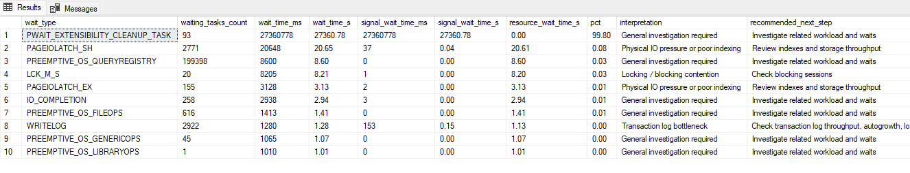
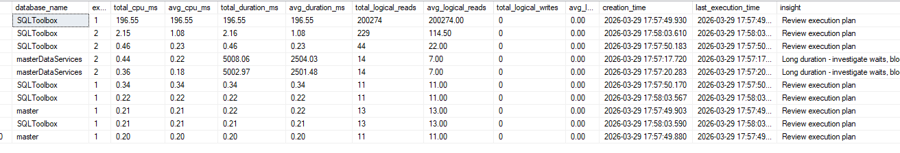
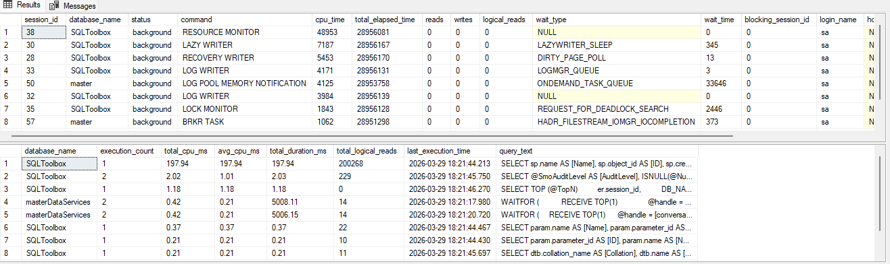

# SQL Toolbox


# 🚀 SQL Server Performance Toolkit

> When a database is slow, you need answers fast — not guesswork.

A lightweight **T-SQL diagnostic toolkit** that helps you quickly identify:

* What SQL Server is waiting on
* Which queries are causing the problem
* Whether blocking or deadlocks are involved

No agents. No setup. Just run and diagnose.

---

## ⚡ What you get in 30 seconds

```sql
USE SQLToolbox;

EXEC SQLToolbox.WaitStatsSummary;
EXEC SQLToolbox.TopSlowQueries;
```

→ Instantly see:

* Root cause (wait stats)
* Problem queries
* Where to investigate next

---

## 🧰 Included Tools (Community Edition)

### 🧠 WaitStatsSummary

Identify what SQL Server is actually waiting on.

* Detect locking, IO, CPU pressure
* Includes interpretation and next steps



---

### 🔍 TopSlowQueries

Find the most expensive queries in the plan cache.

* CPU, duration, reads
* Query text included
* Quick optimization targets



---

### 🚧 BlockingMonitor

See active blocking chains in real time.

* Who is blocking who
* Session details
* Running statements

---

### 💥 DeadlockDetector

Read deadlock graphs from `system_health`.

* Latest deadlocks
* XML output for deep analysis

---

### ⚡ LivePerformanceAnalyzer (Light)

Quick snapshot of:

* Active requests
* Top CPU queries



---

## 🧠 Recommended Workflow

When something is slow:

1. **WaitStatsSummary** → identify problem type
2. **TopSlowQueries** → find expensive queries
3. **BlockingMonitor** → check contention
4. **LivePerformanceAnalyzer** → confirm current activity

Or run:

```text
EXAMPLES/basic_workflow.sql
```

---

## 🟢 Community vs 🔴 PRO

| Feature                              | Community | PRO |
| ------------------------------------ | --------- | --- |
| Wait stats                           | ✔         | ✔   |
| Slow queries                         | ✔         | ✔   |
| Blocking & deadlocks                 | ✔         | ✔   |
| Live diagnostics                     | ✔         | ✔   |
| One-command full analysis (`RunAll`) | ❌         | ✔   |
| HTML report                          | ❌         | ✔   |
| Health score                         | ❌         | ✔   |
| Historical tracking                  | ❌         | ✔   |
| Automation (SQL Agent)               | ❌         | ✔   |

---

## 🚀 SQL Toolbox PRO

If you find yourself running multiple scripts manually every time…

SQL Toolbox PRO turns this into a **complete diagnostic system**:

* 🔥 One-command full analysis (`RunAll`)
* 📊 HTML performance report
* 🧠 Health score
* 📈 Historical tracking
* ⚙️ Automation support

👉 Save time. Stop guessing. Diagnose faster.

👉 **Get PRO version:** https://mariovista01.gumroad.com/l/SQLToolBox_PRO

---

## ⚙️ Installation

Run:

```sql
INSTALL/10_SQLToolbox_Community_INSTALL.sql
```

Then:

```sql
USE SQLToolbox;

EXEC SQLToolbox.WaitStatsSummary;
```

---

## 📁 Repository Structure

```text
sql-toolbox/
│
├── INSTALL/
│   └── 10_SQLToolbox_Community_INSTALL.sql
│
├── src/
│   ├── WaitStatsSummary.sql
│   ├── TopSlowQueries.sql
│   ├── BlockingMonitor.sql
│   ├── DeadlockDetector.sql
│   └── LivePerformanceAnalyzer.sql
│
├── EXAMPLES/
│   └── basic_workflow.sql
│
└── README.md
```

---

## 🛣️ Roadmap

* Query Store integration
* Backup status checks
* Extended performance insights
* More automation options

---

## ⭐ Support

If you find this useful:

* ⭐ Star the repo
* 💬 Share feedback
* 🚀 Upgrade to PRO

---

## 📄 License

MIT (Community Edition)

---

> This is the toolkit I use when production is slow and I need answers immediately.
